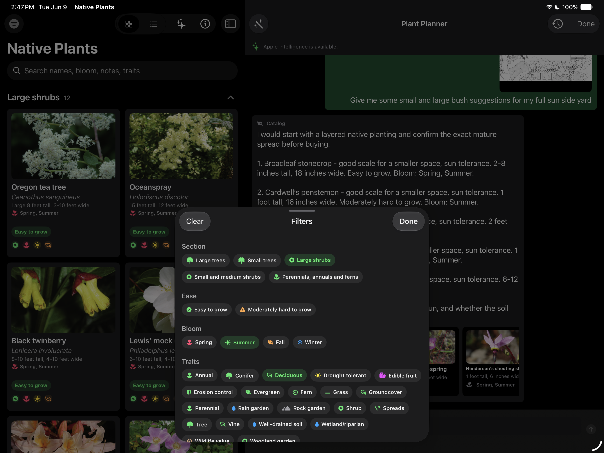
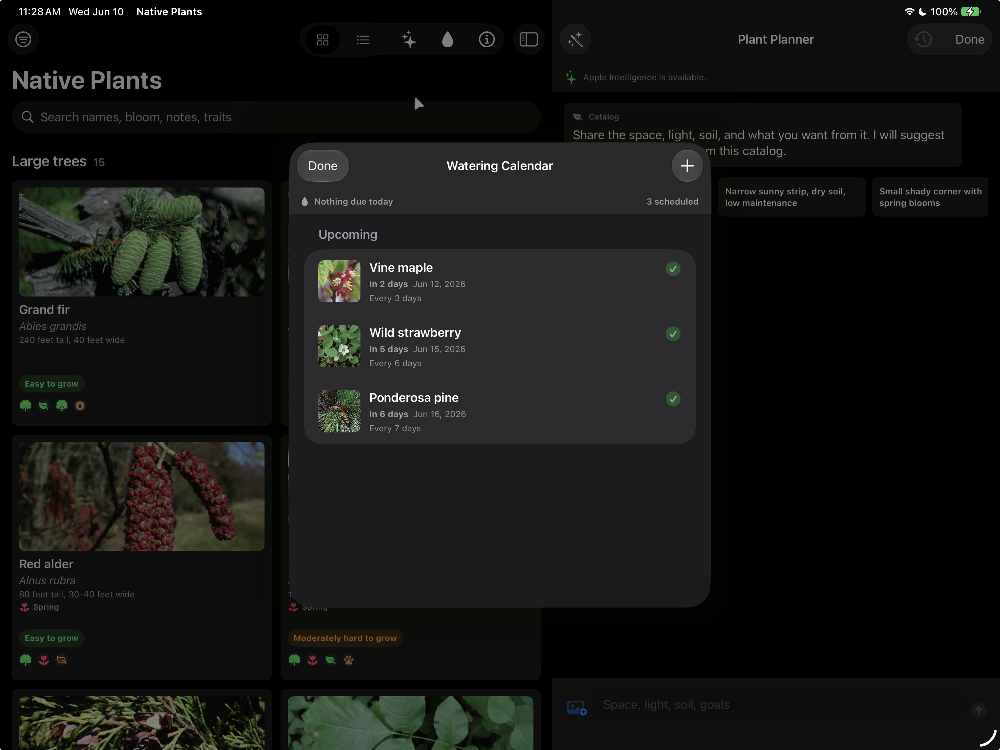
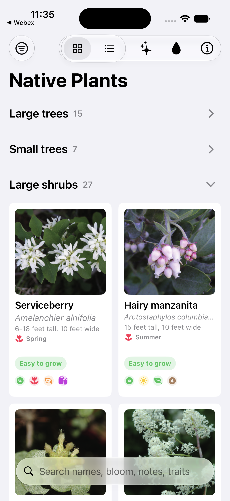
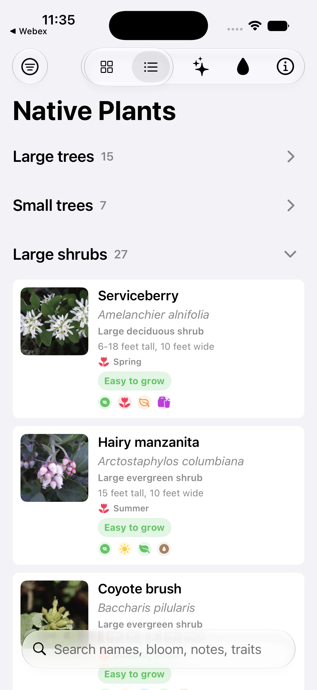
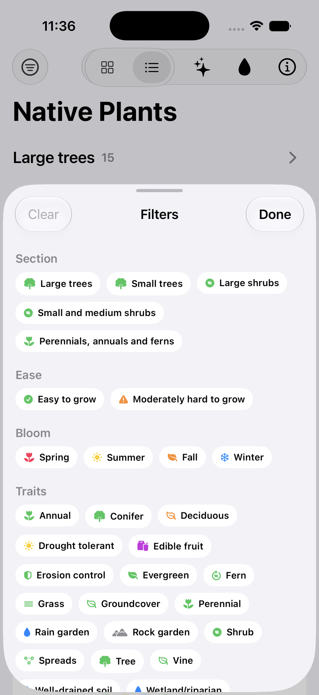
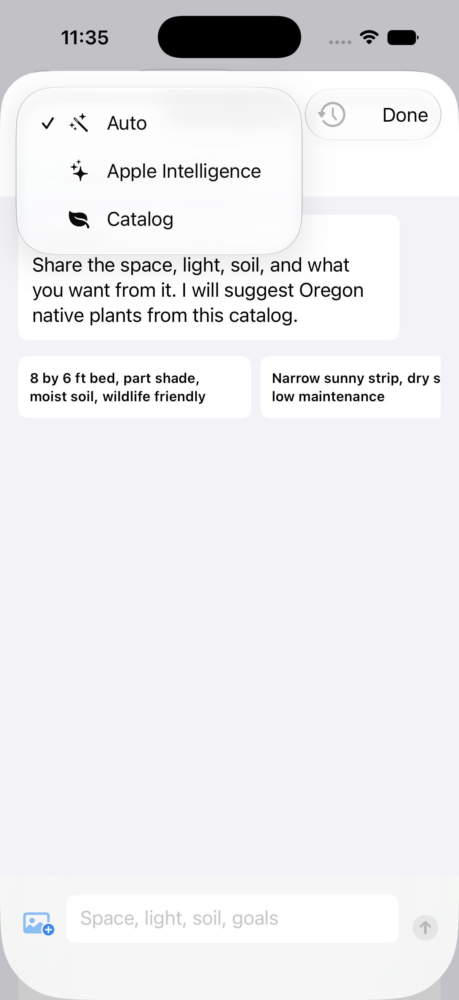

# Native Plants

Native Plants is a SwiftUI iOS app for exploring a curated catalog of Oregon native plants. It helps gardeners search by plant name, bloom timing, traits, section, and ease of care; compare plants in grid or list layouts; favorite and reorder key plants; review photos, icon cues, and care notes; ask an AI-assisted planner for catalog-backed recommendations; and manage recurring watering schedules.

## Screenshots

### iPad

| Home and AI planner | Catalog filters | Watering schedule |
| --- | --- | --- |
|  |  |  |

### iPhone

| Grid catalog | List catalog | Filters | AI planner |
| --- | --- | --- | --- |
|  |  |  |  |

## What the App Does

- Browses Oregon native plants grouped by catalog section, with search across names, bloom cues, notes, and traits.
- Filters plants by section, ease, bloom season, and trait chips, then shows an active filter count in the toolbar.
- Offers grid and list browsing modes, a pinned favorites section, plant detail pages, image-backed cards, bloom summaries, care difficulty badges, and a plant icon key.
- Saves favorite plants from detail pages or catalog long-press menus, then lets people reorder the favorites shown at the top of the catalog.
- Adapts between a focused iPhone catalog flow and an iPad split-view layout that can keep the catalog and planner visible together.
- Includes a Plant Planner conversation view that can recommend plants for a described site, such as a shady corner, dry strip, small bed, or wildlife-friendly planting.
- Supports optional yard photo attachments in the planner as context for the conversation.
- Tracks watering schedules with suggested cadence, due and upcoming lists, mark-watered actions, notes, and recurring next-water calculations.

## iOS 27 and Modern iOS APIs

The app is built as a small showcase of recent iOS app integration points. SDK- and runtime-sensitive features still use availability checks where the framework can be unavailable or disabled at runtime.

- **Apple Intelligence and Foundation Models**: The Plant Planner uses `FoundationModels` when available, including `SystemLanguageModel.default`, `LanguageModelSession`, `Instructions`, `GenerationSchema`, `DynamicGenerationSchema`, `GeneratedContent`, and `GenerationOptions`. It asks the on-device model for structured planting plans and then maps generated plant IDs back to known catalog entries. If Apple Intelligence is unavailable, disabled, not ready, or the framework is missing, the app falls back to a deterministic catalog matcher.
- **Structured AI output**: Planner responses are constrained to a schema with profile summary, layout strategy, three to five catalog plant recommendations, fit reasons, cautions, and an optional follow-up question. This keeps generated output tied to plants that actually exist in the app.
- **PhotosUI**: The planner uses `PhotosPicker` to attach a yard photo or sketch to a planning turn.
- **App Intents and Shortcuts**: Watering workflows are exposed through `AppIntent`, `AppEntity`, `EntityStringQuery`, `EnumerableEntityQuery`, and `AppShortcutsProvider`. Users can schedule plant watering, open the watering calendar, open watering details for a plant, and mark a plant watered from app shortcuts or Siri.
- **Core Spotlight entity indexing**: Plants and watering schedules implement `IndexedEntity` and are indexed with `CSSearchableIndex.indexAppEntities`, making catalog and watering data discoverable through system search.
- **NSUserActivity app entity linking**: Plant detail screens attach an app entity identifier to the current activity, helping the system understand which plant page is being viewed.
- **SwiftUI reorderable favorites**: Favorite ordering is persisted locally and exposed through a reorder sheet that uses `DynamicViewContent.reorderable()` from the iOS 27 SwiftUI SDK.
- **SwiftUI navigation and presentation**: The main interface uses `NavigationSplitView`, `NavigationStack`, `.searchable`, sheets with detents, toolbar controls, and adaptive compact/regular layouts so the catalog and planner work across iPhone and iPad.

## Project Notes

- The Xcode project deployment target is iOS 27 and should be built with Xcode 27 or newer.
- Foundation Models usage is currently guarded in source with iOS 26 availability annotations, matching the SDK symbols in this checkout. This is the Apple Intelligence API family the app is using for the iOS 27-era planner experience.
